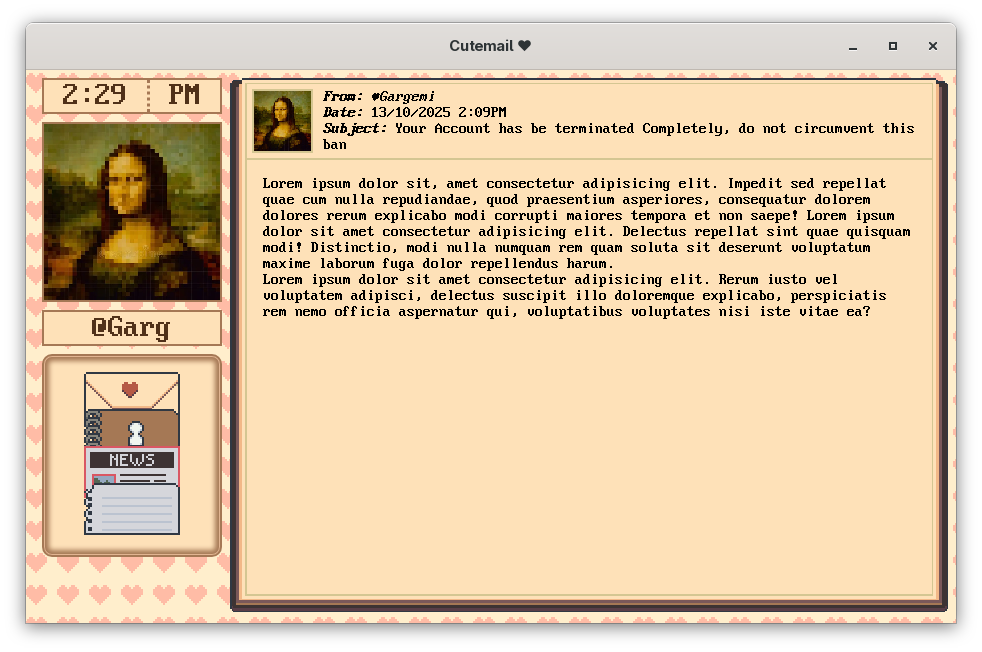
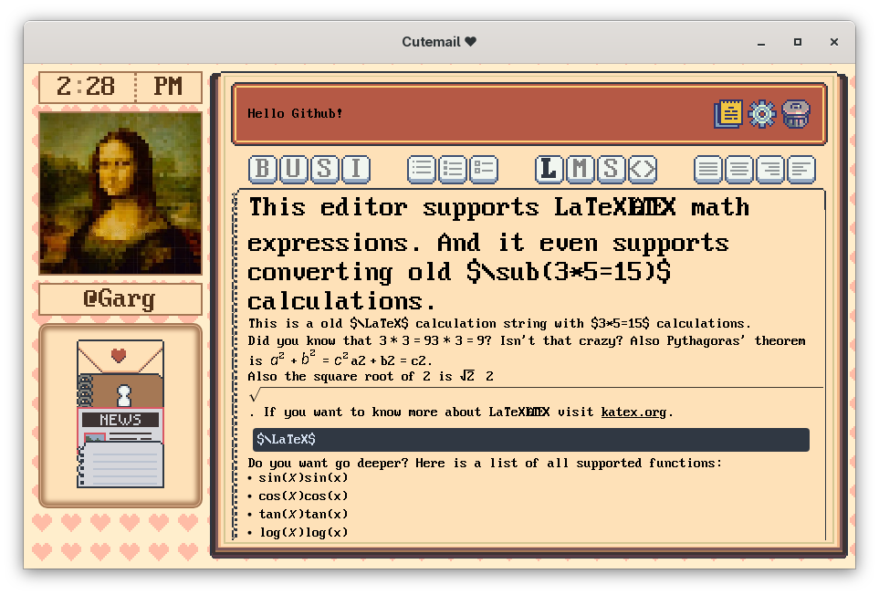

# **CuteMail**: The _cute_ way to communicate!

**Project Aim**: Make a cute way to contact your friends, with pixel art and cutesy color palette. The user should be able to sign up, log-in and log-out all inside the application. The messages should be sent securely and encrypted.

**Other Features**: Note-taking, reading the news and send giftcards (animated pictures) to friends!

**Project Status**: The Application is just UI currently and does not have any logic.
